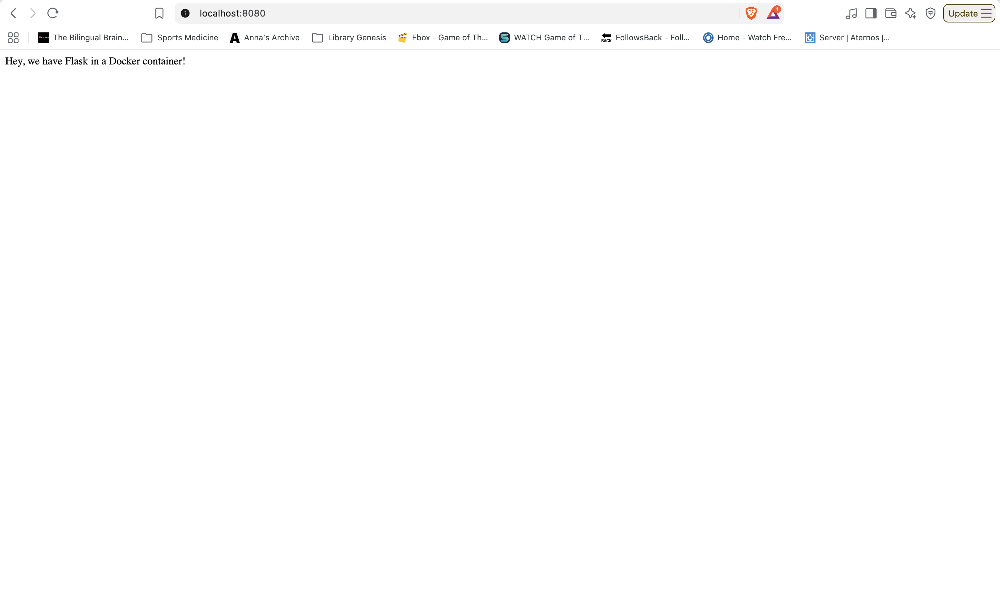

# Flask Docker

Homework assignment that demonstrates how to run a Flask web application inside a Docker container. Modified instructions to use a modern Python and Flask environment. Is accessed through an SSH port-forwarded connection.

